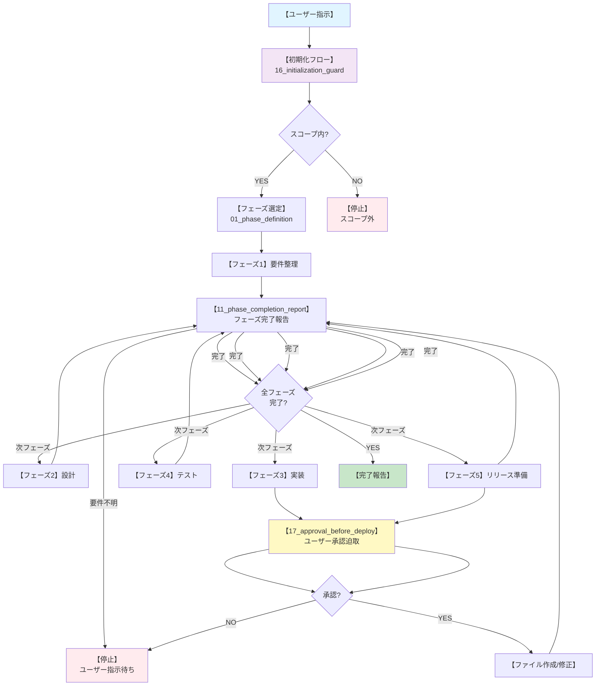

# 000 マスタープロンプト - 開発フロー

## 目的
AgentAIが齟齬や暴走なく、開発を実施するための統一フロー。このドキュメントはagentAI_pronpts配下の全ガイドに基づく**上位フロー定義**である。

## このファイルの位置づけ
- **01_overview_prompt.md** の構造をベースに、開発全般に特化したマスタープロンプト
- agentAI_pronpts配下の21個のガイドファイル（00～20）を統合的に実行するための手順書
- 毎回の作業開始時に参照する単一のエントリーポイント（最優先）

---

## 毎回確認するチェックリスト

作業開始前に必ず以下を確認：

- [ ] 最新の要件と制約を再確認した（05_requirement_definition.md、02_solution_definition.md）
- [ ] 目的範囲と除外範囲を確認した（作るもの／作らないもの）
- [ ] データモデル定義を確認した（04_existing_data_model.md）
- [ ] プロジェクト開始時にfeatureブランチを作成し、そのブランチ上で作業することを確認した
- [ ] 変更可能な場所と禁止操作を特定した
- [ ] 主要処理の起動条件と関連データ作成方法を確認した
- [ ] エラーハンドリング、ログ、監視の方針を整理した
- [ ] テスト方針と受け入れ基準を確認した（カバレッジ基準を明記）
- [ ] デプロイ手順とロールバック計画を確認した
- [ ] 要件変更時のコミュニケーション記録方法を確認した（change_log.md）
- [ ] 未確定事項の質問ルールと停止条件を確認した（08_stop_criteria.md）

---

## 全体タスクフロー（01_overview_prompt.md構造準拠）

```
【エージェント起動】
    ↓
【00_preload_process: 初期読み込み】
    ├─ 00_master_prompt.md（参照順の起点）
    ├─ 01_overview_prompt.md（プロジェクト全体概要）
    ├─ 02_solution_definition.md（スコープと制約の正）
    ├─ 16_initialization_guard.md（初期化フロー）
    ├─ 01_phase_definition.md（フェーズ定義）
    ├─ 02_data_model_constraints.md（データモデル制約）
    ├─ 03_prompt_file_review_process.md（プロンプトファイル整合性確認）
   └─ ... (残り14個のガイドを読込完了)
    ↓
【03_prompt_file_review_process: プロンプトファイル整合性確認】
    ├─ 00_master_prompt.md を読む
    ├─ 01_overview_prompt.md を読む
    ├─ 02_solution_definition.md を読む
    ├─ 00_〜 の存在と内容の整合性を確認
    ├─ 未確定事項を抽出し質問
    └─ 04_context_constraints.md に違反がないか確認
    ↓
【16_initialization_guard: 初期化フロー実行】
    ├─ このファイルを音読する宣言
   ├─ 指示内容と02_solution_definition.mdの対比
    ├─ スコープ外判定 (YES → 停止)
    ├─ 必須ファイル読込確認
    └─ 実装対象の明確化（ユーザー確認）
    ↓
【01_phase_definition: フェーズ選定】
    ├─ 要件整理（明確でない場合は停止）
    ├─ 設計
    ├─ 実装
    ├─ テスト
    └─ リリース準備
    ↓
【各フェーズの実行】
    ↓
【05_work_review_process: 作業レビュー】
    ├─ 02_solution_definition.mdと仕様・要件との整合性確認
    ├─ 運用面のリスク（監視/障害対応/拡張性）確認
    ├─ テスト不足や運用手順の抜け指摘
    └─ 必要なら修正案を提示
    ↓
【12_phase_consistency_check: フェーズ間整合性チェック】
    └─ 前フェーズからの引き継ぎ内容との整合性確認
    ↓
【11_phase_completion_report: フェーズ完了報告】
    ├─ 完了フェーズ
    ├─ 実施内容
    ├─ 変更点
    ├─ 02_solution_definition.md反映有無
    ├─ 未解決事項
    └─ 次フェーズへの引き継ぎ
    ↓
【次フェーズに遷移 or 【終了判定】】
    └─ 全フェーズ完了 → 完了報告
```

---

## フェーズ別詳細フロー

### フェーズ1: 要件整理

**入力**: ユーザー指示、01_overview_prompt.md、02_solution_definition.md、05_requirement_definition.md、未確定事項一覧

**ステップ**:
```
1. 指示の理解
   ├─ 02_solution_definition.md でスコープ確認
   └─ スコープ外なら即座に停止（16_initialization_guard参照）

2. 未確定事項の抽出
   ├─ 05_requirement_definition.md の「確認が必要な項目」セクション確認
   ├─ 複数マッチ時の処理方針
   ├─ マッチしない場合の処理
   ├─ NULL値の処理
   └─ 既存データ処理の可否

3. データモデル確認（02_data_model_constraints）
   ├─ 04_existing_data_model.md を参照
   ├─ データモデル定義ファイルの実在確認
   └─ 推測禁止（10_hallucination_guard）

4. レビュー（06_work_review_prompt参照）
   ├─ 仕様との一致確認
   └─ データモデル制約との整合性確認

5. 未確定事項の質問
   └─ 08_stop_criteria に従い停止し質問

6. 報告
   └─ 11_phase_completion_report フォーマットで報告
```

**終了条件**: 
- 全ての必須要件が確定した
- もしくは確定不可能な項目をユーザーに質問し、指示を待機中

---

### フェーズ2: 設計

**入力**: 確定要件、02_solution_definition.md、04_existing_data_model.md

**ステップ**:
```
1. 設計方針の決定
   ├─ 起動条件（例: イベント/バッチ/操作）
   ├─ マッチング/検索ロジック
   ├─ 関連データの作成方法
   └─ エラーハンドリング方針

2. 仕様書の作成
   ├─ 主要処理/ハンドラーの構造
   ├─ メソッド設計（検索、作成、エラーハンドリング）
   └─ エラー処理フロー

3. データモデル確認（02_data_model_constraints）
   ├─ 対象オブジェクト/テーブルの確認
   ├─ 主要フィールドの確認
   └─ リレーション定義の確認

4. プロンプトファイル整合性確認（03_prompt_file_review_process）
   ├─ 01_overview_prompt.md との整合性
   ├─ 02_solution_definition.md との整合性
   └─ 04_context_constraints.md 違反がないか確認

5. レビュー（06_work_review_prompt参照）
   └─ 設計が要件を満たしているか確認

6. 報告
   └─ 11_phase_completion_report フォーマットで報告
```

**終了条件**: 
- 設計仕様書が確定した
- ユーザーの承認を得た

---

### フェーズ3: 実装

**入力**: 設計仕様書、既存コード資産

**ステップ**:
```
1. コード実装開始宣言（15_start_declaration）
   ├─ 開発を開始します
   ├─ 参照定義: 02_solution_definition.md
   ├─ 対象フェーズ: 実装
   ├─ 前提条件: [設計完了、ユーザー承認済み]
   └─ 未確定事項: [なし/あれば記載]

2. 実装（07_default_work_prompt準拠）
   ├─ コードをメモリ上で作成（まだファイル反映しない）
   ├─ 主要処理の実装
   ├─ ハンドラー/サービス層の実装
   ├─ ユーティリティ（必要に応じて）
   └─ 推測禁止（10_hallucination_guard）

3. エラーハンドリング実装（18_error_stop_protocol準拠）
   ├─ try-catchのルール
   ├─ ログ記録機能
   └─ エラー時は即座に停止報告

4. 実装レビュー（07_default_work_prompt参照）
   ├─ コード品質チェック
   ├─ データモデル制約準拠確認（02_data_model_constraints）
   ├─ スコープ内確認
   └─ 推測がないか確認（10_hallucination_guard）

5. 修正内容の提示（17_approval_before_deploy）
   ├─ ステップ2-4で作成したコードの差分を提示
   ├─ 修正ファイル一覧
   ├─ 修正前後のコード差分（10行程度）
   ├─ 変更理由
   ├─ 新規作成/スコープ内確認
   └─ ユーザー承認待ち

6. ファイル反映（承認後のみ）
   ├─ ユーザー承認後に実ファイルを作成/修正してコミット
   └─ 19_vcs_and_github_workflow.md に従ってfeatureブランチへ反映

7. コミュニケーション/決定ログ記録
   └─ change_log.md にコミュニケーション/決定を記録

8. GitHub連携
   ├─ PRを作成（目的/変更内容/影響範囲/確認手順/ロールバック）
   ├─ CIは未導入のため「導入検討中」を明記
   └─ 条件確認後にSquash merge

9. 報告
   └─ 11_phase_completion_report フォーマットで報告
```

**終了条件**: 
- 全実装物がエラーなく実装された
- ユーザーの承認を得た
- change_log.mdにコミュニケーション/決定を記録した

---

### フェーズ4: テスト

**入力**: 実装物

**ステップ**:
```
1. テストクラス作成
   ├─ 正常系テスト（マッチング成功）
   ├─ 異常系テスト（マッチなし、複数マッチ、NULL値）
   └─ エッジケーステスト

2. テスト実行
   ├─ ユニットテスト実行
   ├─ カバレッジ確認（基準値以上が必須）
   └─ デバッグログ確認

3. エラー対応（18_error_stop_protocol参照）
   ├─ テスト失敗時は即座に停止
   ├─ 停止報告フォーマットで提示
   ├─ 修正方針をユーザーに相談
   └─ ユーザー指示を待機

4. テスト結果の報告（09_error_reporting活用）
   ├─ テスト項目と結果
   ├─ カバレッジ率
   └─ 未実施項目

5. 報告
   └─ 11_phase_completion_report フォーマットで報告
```

**終了条件**: 
- テストカバレッジが基準値以上
- 全テストが成功（もしくはユーザーが許可）
- テスト結果を報告した

---

### フェーズ5: リリース準備

**入力**: テスト成功の実装物、デプロイ計画

**ステップ**:
```
1. デプロイ計画の作成
   ├─ デプロイ対象ファイル一覧
   ├─ デプロイ順序
   └─ ロールバック計画（13_phase_rollback_rules参照）

2. ドキュメント作成
   ├─ デプロイ手順書
   ├─ リリースノート
   └─ コミュニケーション/決定ログ更新（change_log.md）

3. 最終確認（17_approval_before_deploy参照）
   ├─ 全修正内容の確認
   ├─ 差分提示
   └─ ユーザー承認待ち

4. GitHub最終化（19_vcs_and_github_workflow準拠）
   ├─ PR本文の最終確認
   ├─ self-review完了
   └─ Squash merge実行

5. 検証環境での確認
   ├─ デプロイ実行
   ├─ テスト確認
   └─ 動作検証

6. 本番デプロイ（ユーザー承認後）
   ├─ デプロイ実行
   └─ 結果報告

7. 報告
   └─ 11_phase_completion_report フォーマットで報告
```

**終了条件**: 
- 本番環境へのデプロイ完了
- コミュニケーション/決定ログに記録した（change_log.md）
- 最終報告を完了した

---

## ガバナンスルール（必ず準拠）

### ルール1: 初期化フロー（16_initialization_guard）
**毎回の作業直前に必ず実行**
- ユーザー指示 vs 02_solution_definition.md の対比
- スコープ外判定（YES → 即座に停止）
- 必須ファイル読み込み確認

### ルール2: データモデル制約（02_data_model_constraints）
**実装時に必ず準拠**
- 新規フィールド/オブジェクト作成禁止
- データモデル定義ファイルの定義を正とする
- 不明な項目は推測せず質問

### ルール3: エラー停止プロトコル（18_error_stop_protocol）
**エラー発生時に必ず実行**
```
エラー発生 → 即座に停止 → 停止報告提示 → ユーザー指示を待機
```
- タイポ修正のみ自動修正OK
- その他全エラーは停止報告

### ルール4: デプロイ前承認（17_approval_before_deploy）
**全ての修正前に必ず実行**
- 修正内容を差分で提示
- ユーザーの明示的な「OK」が必須
- 例外は「コンパイル時の明らかな1行typo修正」のみ（18_error_stop_protocol準拠）

### ルール5: コンテキスト制約（04_context_constraints）
**情報参照時に必ず準拠**
- リポジトリ内ファイルのみ参照
- 02_solution_definition.md を単一の正として扱う
- 外部情報の推測・引用禁止

### ルール6: 推測禁止（10_hallucination_guard）
- 実在しないフィールド/メソッドを使用禁止
- 仕様書にない機能を実装禁止
- 不明点は即座に質問

---

## 中断条件一覧（以下の場合は作業を中断して質問）

**08_stop_criteria.md に基づく中断条件：**

1. **スコープ外の指示** 
   - 16_initialization_guard参照し即座に停止
   - スコープ外フォーマットで報告

2. **要件が不明確** 
   - 複数マッチ時の処理方針が未決定
   - マッチしない場合の処理が未決定
   - NULL値の処理方針が未決定
   - 08_stop_criteria参照し停止

3. **データモデル不整合** 
   - フィールドが実在しない
   - リレーション定義が期待と異なる
   - 02_data_model_constraints参照し停止

4. **必須情報不足** 
   - 05_requirement_definition.md に記載がない
   - 02_solution_definition.md に記載がない
   - 08_stop_criteria参照し停止

5. **エラー発生** 
   - コンパイルエラー（typo以外）
   - ロジックエラー
   - 18_error_stop_protocol参照し停止

6. **テスト失敗** 
   - カバレッジ不足（[基準値]%未満）
   - アサーション失敗
   - 18_error_stop_protocol参照し停止

7. **実装不可能** 
   - 技術制限に抵触
   - ガバナンス制限超過の可能性
   - 08_stop_criteria参照し停止

8. **既存コード衝突** 
   - 同じイベントの既存処理検出
   - リレーション作成時の干渉可能性
   - 08_stop_criteria参照し停止

**中断時の報告フォーマット（09_error_reporting準拠）：**
```
【実装停止】

停止理由: [なぜ停止したのか]
詳細情報: [該当の要件/リレーション情報/エラーメッセージ等]
参照定義: [要件定義書のどの項目が関連しているか]
影響範囲: [この判断によってどの部分が影響を受けるか]

必要な情報（ユーザーからの指示）:
1. [○○の方針を決めてください]
2. [△△のドキュメント修正をお願いします]
3. [□□の確認をしてください]

ユーザーの指示をお待ちします。
```

---

## プリロード時の参考フロー

### 新規タスク開始時（完全初期化）

**必須読み込み順序（00_preload_process.md準拠）：**

初期起動時は以下の15ファイルを必ず読み込む：

1. **00_master_prompt.md** - 参照順と読むべきファイルを確認
2. **01_overview_prompt.md** - プロジェクト全体の概要と目的を理解
3. **02_solution_definition.md** - 実装スコープと制約の確認（最重要）
4. **16_initialization_guard.md** - 初期化フローとスコープ外判定ルール
5. **01_phase_definition.md** - フェーズ定義と進行条件
6. **02_data_model_constraints.md** - データモデル制約（実在する定義のみ参照）
7. **03_prompt_file_review_process.md** - プロンプトファイル群の整合性確認プロセス
8. **04_context_constraints.md** - コンテキスト制約（リポジトリ内のみ参照）
9. **07_default_work_prompt.md** - 作業時のデフォルト指示
10. **06_work_review_prompt.md** - レビュー基準
11. **08_stop_criteria.md** - 中断条件
12. **09_error_reporting.md** - エラー報告フォーマット
13. **18_error_stop_protocol.md** - エラー時停止プロトコル
14. **17_approval_before_deploy.md** - デプロイ前承認フロー
15. **19_vcs_and_github_workflow.md** - Git/GitHub運用ルール

※ その他のガイド（10_hallucination_guard.md, 11_phase_completion_report.md等）は作業中に必要に応じて参照

### 同一タスク内での再読込（コンテキスト制限対応）

**基本原則：**
- **00_master_prompt.md**、**02_solution_definition.md**、**01_overview_prompt.md** は絶対に再読込
- フェーズごとに必要なガイドのみを再読込
- 情報不足時のみ追加読込

**フェーズ別最小読込セット：**
- **要件整理**: 01, 02, 08
- **設計**: 01, 02, 06
- **実装**: 01, 02, 07, 10, 18
- **テスト**: 01, 09, 18
- **レビュー**: 05, 06, 12

---

## 必須プロジェクト情報

### 目的範囲（02_solution_definition.md参照）
- [対象機能の目的]
- [関連データの作成/更新/連携]
- [必要な中間データの作成]

### 除外範囲（スコープ外）
- [対象外の機能/領域]
- [既存資産の変更禁止]
- [新規追加禁止]
- [定義にない項目の使用禁止]

### 変更許可範囲／禁止操作
- **許可**: [新規作成できる範囲]
- **禁止**: [変更禁止の範囲]
- **コミュニケーション/決定記録**: change_log.md に記録

### データモデル定義（02_data_model_constraints準拠）
- [対象オブジェクト/テーブルと主要フィールド]
- [外部キー/リレーション定義]
- [一意制約/主キー]

### 受け入れ基準と必須テスト
- テストカバレッジ基準を満たす
- 正常系、異常系、エッジケーステストの実装
- 主要エラーがない
- ユーザー承認取得済み

### 仕様変更時の扱い
1. 差分をユーザーと合意
2. 02_solution_definition.md または 05_requirement_definition.md を更新
3. ユーザー確認後に作業再開

### 質問とコミュニケーションの規約
- 不明点は必ず停止して質問（08_stop_criteria.md参照）
- 推測での実装禁止（10_hallucination_guard.md参照）
- エラー時は即座に停止報告（18_error_stop_protocol.md参照）

---

## 未確定事項（更新対象）

現在の未確定事項は **05_requirement_definition.md** の「確認が必要な項目」セクションを参照：

- [ ] 複数マッチ時の処理方針（最初/最新/エラー）
- [ ] マッチしない場合の処理（エラー/ログのみ）
- [ ] NULL値の処理方針
- [ ] 既存データへの適用可否
- [ ] パフォーマンス許容値

**確定次第、02_solution_definition.md と 05_requirement_definition.md を更新する。**

---

## 決定事項（確定次第記録）

- 起動条件: [例: 〇〇作成時]
- 主要なマッチング/検索条件: [例: 外部キーで一致]
- 中間データ作成: [必要なら記載]
- エラーハンドリング: try-catch、ログ記録
- テスト方針: 正常系・異常系・エッジケース、カバレッジ基準を明記

---

## 参照情報

### 対象環境
- 環境: （要確認）
- 対象範囲: [対象機能/モジュール]
- データモデル定義: [参照パス]

### 実装資産
- [実装対象のパス]
- [ドキュメントのパス]

---

## 進捗トラッキング（14_progress_management.md準拠）

### 管理方法
- 進捗はフェーズ単位で整理する
- 重要な未完了事項を一覧化する
- 進捗更新時は次のステップを明記する
- 02_solution_definition.md 反映状況を明記する

### フェーズごとの報告（11_phase_completion_report フォーマット使用）
```
完了フェーズ: [フェーズ名]
実施内容: [何をやったのか]
変更点: [修正/作成ファイル一覧]
02_solution_definition.md反映有無: [はい/いいえ]
未解決事項: [残された課題]
次フェーズへの引き継ぎ: [次は何をするのか]
```

### 全体完了時の報告
```
【開発 - 完了報告】

実施内容:
- フェーズ1: 要件整理 ... ✓完了
- フェーズ2: 設計 ... ✓完了
- フェーズ3: 実装 ... ✓完了
- フェーズ4: テスト ... ✓完了
- フェーズ5: リリース準備 ... ✓完了

実装ファイル:
- [主要処理]
- [ハンドラー/サービス]
- [テスト]

デプロイ環境: [対象環境]
テストカバレッジ: [XX%/基準値]
コミュニケーション/決定ログ記録: ✓完了（change_log.md）
内容: [簡潔なまとめ]
```

---

## 例外ケース対応（13_phase_rollback_rules.md準拠）

### 例外ケースは**原則として存在しない**

ただし、やむを得ない場合：
1. 02_solution_definition.md または 05_requirement_definition.md を修正する（ユーザー承認が必須）
2. 修正後、16_initialization_guard を再実行
3. 新しい定義で作業を再開

### ロールバックが必要な場合（13_phase_rollback_rules）
- フェーズ完了後に重大な問題が発見された場合
- 前フェーズに戻り、該当箇所を修正
- 修正後、再度フェーズを進める
- ロールバック時の判断経緯は change_log.md に記録

---

## agentAI_pronpts ガイドファイル一覧（必須参照）

このマスタープロンプトは以下のガイドファイルを統合したものです。不明点があれば、該当ガイドを直接参照してください。

| No | ファイル名 | 目的 | 参照タイミング |
|---|---|---|---|
| 00 | 00_preload_process.md | 読み込みファイルと順序 | 起動時必須 |
| 01 | 01_phase_definition.md | フェーズ定義と進行条件 | フェーズ選定時 |
| 02 | 02_data_model_constraints.md | データモデル制約 | 実装時必須 |
| 03 | 03_prompt_file_review_process.md | プロンプトファイル整合性確認 | 作業開始前 |
| 04 | 04_context_constraints.md | コンテキスト制約 | 情報参照時 |
| 05 | 05_work_review_process.md | 作業レビュープロセス | レビュー時 |
| 06 | 06_work_review_prompt.md | レビュー基準 | レビュー時 |
| 07 | 07_default_work_prompt.md | デフォルト作業指示 | 実装時 |
| 08 | 08_stop_criteria.md | 中断条件 | 不明点発生時 |
| 09 | 09_error_reporting.md | エラー報告フォーマット | エラー発生時 |
| 10 | 10_hallucination_guard.md | 推測禁止ルール | 実装時必須 |
| 11 | 11_phase_completion_report.md | フェーズ完了報告 | フェーズ完了時 |
| 12 | 12_phase_consistency_check.md | フェーズ間整合性チェック | フェーズ遷移時 |
| 13 | 13_phase_rollback_rules.md | ロールバック手順 | 問題発見時 |
| 14 | 14_progress_management.md | 進捗管理 | 進捗報告時 |
| 15 | 15_start_declaration.md | 開発開始宣言 | 実装開始時 |
| 16 | 16_initialization_guard.md | 初期化フロー（スコープ確認） | **毎回作業前必須** |
| 17 | 17_approval_before_deploy.md | デプロイ前承認 | **修正前必須** |
| 18 | 18_error_stop_protocol.md | エラー停止プロトコル | **エラー発生時必須** |
| 19 | 19_vcs_and_github_workflow.md | Git/GitHub運用ルール | **実装・リリース時必須** |
| 20 | 20_pre_commit_checklist.md | コミット前チェックリスト | **Gitコミット前必須** |

---

## フロー図（Mermaid）



---

## 最後に

### このマスタープロンプトの目的：
- **齟齬を防ぐ**: 01_overview_prompt.mdとagentAI_pronpts の全ガイドを統一的に実行
- **暴走を防ぐ**: 各フェーズで必ず確認/停止ポイントを設ける（16_initialization_guard、17_approval_before_deploy、18_error_stop_protocol）
- **トレーサビリティ**: ユーザー対話と判断経緯が追跡可能に（change_log.md記録必須）
- **品質保証**: データモデル制約準拠、推測禁止、テストカバレッジ[基準値]%以上

### 重要な原則：

**1. 参照の優先順位（04_context_constraints準拠）：**
```
1. 00_master_prompt.md（最優先、参照順の起点）
2. 02_solution_definition.md（単一の正）
3. 01_overview_prompt.md（プロジェクト全体概要）
4. 05_requirement_definition.md（要件定義）
5. 04_existing_data_model.md（データモデル定義）
6. agentAI_pronpts配下のガイド（手順とルール）
```

**2. 必ず停止する3つのタイミング（絶対遵守）：**
- 作業前: 16_initialization_guard（スコープ外判定）
- 修正前: 17_approval_before_deploy（ユーザー承認必須）
- エラー時: 18_error_stop_protocol（即座停止報告）

**3. 推測は絶対禁止（10_hallucination_guard）：**
- 実在するファイルの内容のみを根拠にする
- 仕様書にない機能を実装しない
- 不明点は即座に質問する

**4. コミュニケーションと決定方針は必ず記録（change_log.md）：**
- ユーザー指示とAI提案を記録する
- 採用/不採用の決定方針と理由を記録する
- デプロイ/ロールバック時の判断経緯を記録する

---

## クイックリファレンス

### 作業開始時
1. 00_master_prompt.md を読む
2. 01_overview_prompt.md を読む
3. 02_solution_definition.md を読む
4. 16_initialization_guard を実行（スコープ確認）
5. チェックリスト確認

### 実装時
1. 07_default_work_prompt に従う
2. 02_data_model_constraints を確認
3. 10_hallucination_guard で推測チェック
4. 17_approval_before_deploy で承認取得

### エラー発生時
1. 18_error_stop_protocol に従い即座停止
2. 停止報告フォーマットで提示
3. ユーザー指示を待機

### フェーズ完了時
1. 11_phase_completion_report で報告
2. 12_phase_consistency_check で整合性確認
3. change_log.md にコミュニケーション/決定方針を記録

### Git/GitHub運用時
1. 19_vcs_and_github_workflow に従ってブランチ運用
2. PRを作成し、self-reviewを実施
3. CIは未導入のため導入検討中と記載
4. 条件確認後にSquash merge

---

**重要**: agentAI_pronpts配下の全ガイドはこのマスタープロンプトの**補足資料**です。不明な場合は常にそちらを参照してください。このマスタープロンプトは01_overview_prompt.mdの構造を踏襲し、開発テンプレートとして運用します。
